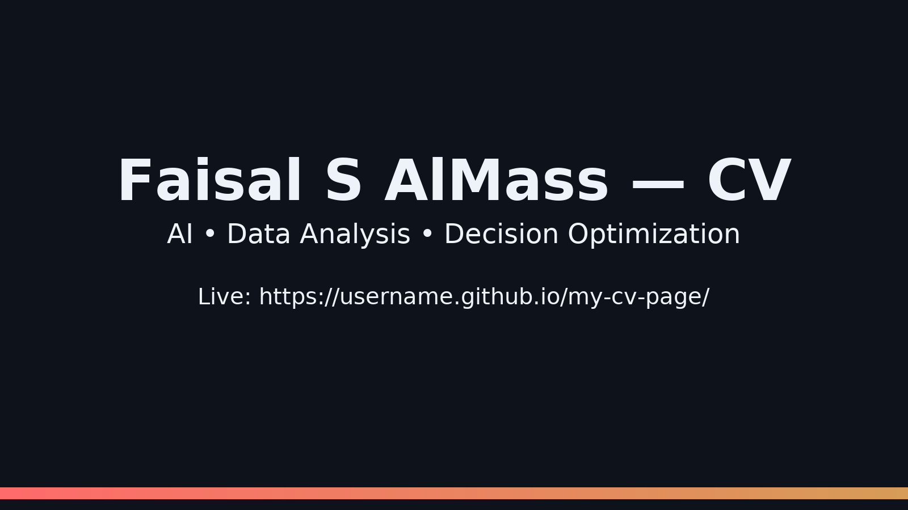

# Faisal AlMass – Personal CV Webpage

A single-page CV website (HTML) with a downloadable PDF.



## 🌐 Live Demo
[**Open the site**](https://FaisalAlMass.github.io/my-cv-page/)  
*(Replace `username` with your GitHub username.)*

## 📂 Files
- **MyWebPageDeskTop.html** — Main webpage.
- **Faisal_AlMass_CV.pdf** — Downloadable CV (PDF).
- **preview.png** — README preview image.

## 🔧 How to Publish (GitHub Pages)
1. Upload `MyWebPageDeskTop.html` and `Faisal_AlMass_CV.pdf` and `preview.png` to the repo root (branch: `main`).
2. Go to **Settings → Pages** → Select `Branch: main` and `/(root)` → **Save**.
3. Your site will be live at:  
   `https://username.github.io/my-cv-page/`

> Ensure the HTML’s CV button points to the file name exactly:
> ```html
> <a href="Faisal_AlMass_CV.pdf" target="_blank" class="btn btn-outline">CV</a>
> ```

## 💡 Notes
- Keep file names **exactly** as referenced in the HTML.
- If you change the repo name, update the Live Demo link above.

## 📜 License
Personal use only. Do not modify or redistribute without permission.

